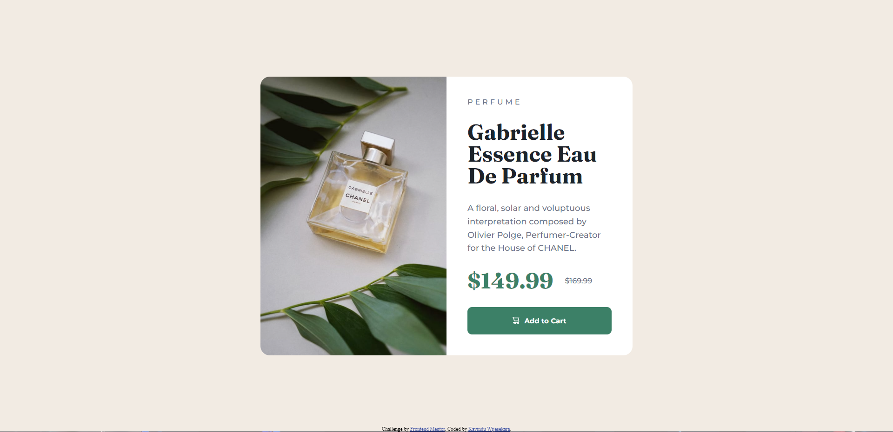
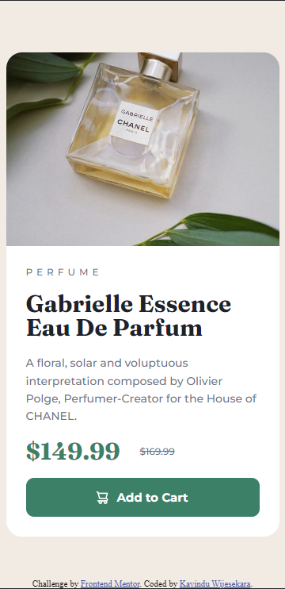

# Frontend Mentor - Product preview card component solution

This is a solution to the [Product preview card component challenge on Frontend Mentor](https://www.frontendmentor.io/challenges/product-preview-card-component-GO7UmttRfa). Frontend Mentor challenges help you improve your coding skills by building realistic projects. 

## Table of contents

- [Overview](#overview)
  - [The challenge](#the-challenge)
  - [Screenshot](#screenshot)
  - [Links](#links)
- [My process](#my-process)
  - [Built with](#built-with)
  - [What I learned](#what-i-learned)
- [Author](#author)


## Overview

### The challenge

Users should be able to:

- View the optimal layout depending on their device's screen size
- See hover and focus states for interactive elements

### Screenshot






### Links

- Solution URL: [Click here to see solution](https://www.frontendmentor.io/solutions/product-preview-card-component-solution-cEGna572P8)
- Live Site URL: [Click here to preview the website](https://ktmogo.github.io/product-preview-card-component-solution/)

## My process

### Built with

- Semantic HTML5 markup
- CSS custom properties
- Flexbox

### What I learned

```css
@media (max-width: 860px) {
    .card {
        width: 345px;
        height: 610px;
        flex-direction: column;
    }

    .img-container {
        background-image: url(./images/image-product-mobile.jpg);
        max-height: 40%;
    }

    .details-container {
        padding: 25px;
        width: 100%;
        height: 100%;
    }

    .details-container span {
        font-size: 12px;
    }

    .details-container h1 {
        font-size: 30px;
        line-height: 1;
    }

    .details-container p {
        font-size: 14px;
        line-height: 1.6;
    }

    .add-cart-btn {
        padding: 15px;
    }
}
```

## Author

- Frontend Mentor - [@KtMoGo](https://www.frontendmentor.io/profile/KtMoGo)
- Twitter - [@KavinduT8456](https://twitter.com/KavinduT8456)

